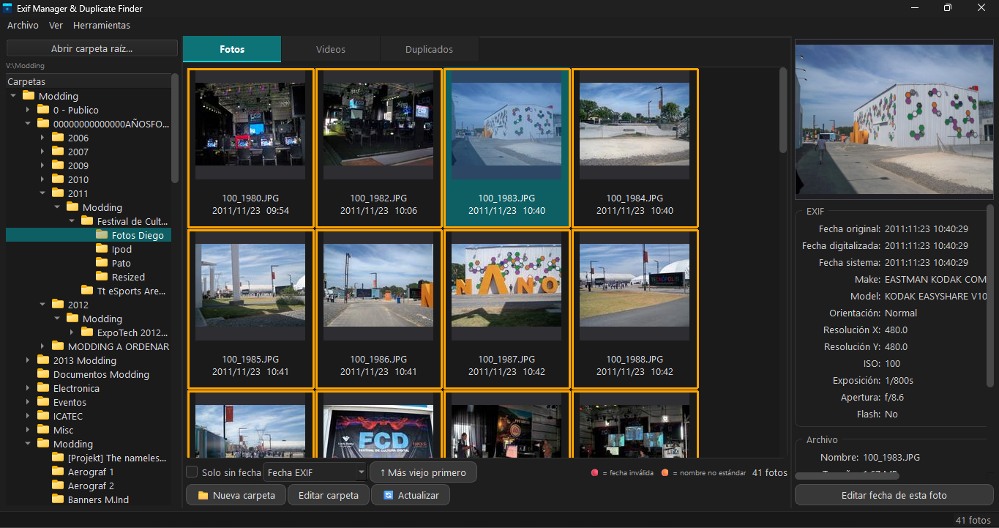
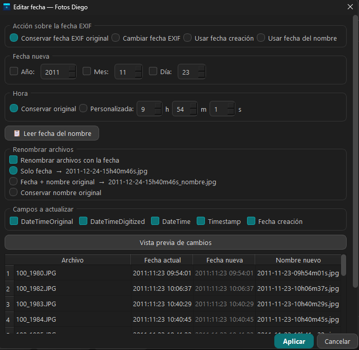
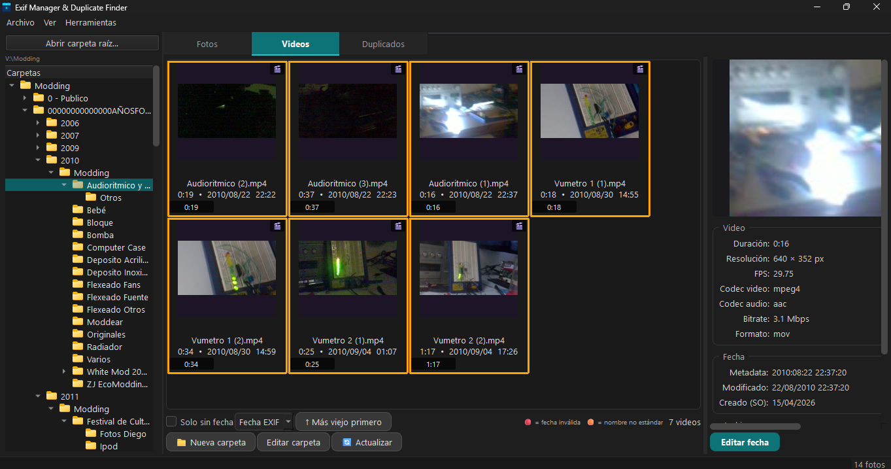
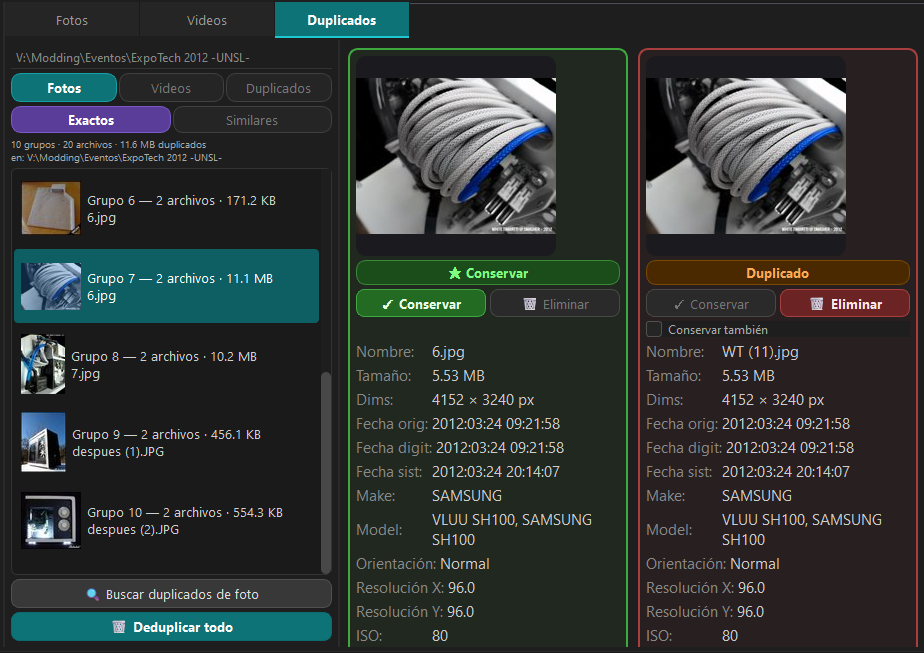

# 📷 Exif Manager & Duplicate Finder

Aplicación de escritorio Windows para gestionar y corregir fechas EXIF de colecciones de fotos y videos familiares, con detección inteligente de duplicados.

---

## ¿Qué problema resuelve?

Muchas fotos y videos de cámaras digitales tienen fechas incorrectas — ya sea porque la batería se agotó y se reseteó, porque la cámara nunca fue configurada, o porque los archivos fueron renombrados o copiados en algún momento. Esto hace que gestores de fotos como **Immich**, Google Photos o cualquier visor cronológico los ubiquen en el lugar equivocado.

EXIF Manager & Duplicate Finder permite:
- ✅ Corregir esas fechas de forma masiva e inteligente
- ✅ Detectar y eliminar archivos duplicados
- ✅ Mantener total trazabilidad sin perder datos originales

---

## 📸 Capturas de pantalla

### Panel principal — Grid de fotos



*Árbol de carpetas (izquierda), grid de miniaturas con bordes de color, panel de metadatos EXIF (derecha).*

---

### Editor de fechas — Fotos



*Editor con vista previa de cambios, selección de campos EXIF, renombrado automático y modos "Usar fecha del nombre" / "Usar fecha creación".*

---

### Editor de fechas — Videos



*Editor de fechas para videos: misma funcionalidad que fotos, usando ffmpeg con recodificación cero (codec=copy).*

---

### Detección de duplicados



*Vista comparativa de duplicados con scoring automático de calidad. El archivo de mayor calidad aparece siempre a la izquierda con el badge ★ Conservar.*

---

## ✨ Features

### 🗂 Navegación de carpetas
- Árbol de carpetas con navegación completa desde una raíz configurable
- Soporte de rutas de red UNC (`\\servidor\share\...`) — compatible con NAS
- Indicador visual **(verde)** en carpetas ya procesadas (tienen backup EXIF)
- Crear subcarpetas nuevas desde la interfaz
- Mover fotos a otra carpeta via menú contextual "Mover a…"
- Excluye automáticamente carpetas internas (`_thumbcache`, `_eliminados`, `_duplicados_eliminados`)

### 🖼 Grid de fotos
- Carga progresiva en **dos fases** — sin bloqueos en la UI
  - Fase 1: miniaturas desde caché + leer fechas EXIF (con **caché de disco** en `_thumbcache/_exif_cache.json` para apertura instantánea en la segunda visita)
  - Fase 2: regenerar miniaturas faltantes en segundo plano
- **Borde rojo** en fotos con fecha EXIF inválida o ausente
- **Borde naranja** en fotos cuyo nombre de archivo no sigue el formato estándar `YYYY-MM-DD-HHhMMmSSs.ext`
- Los archivos con problemas se agrupan automáticamente al **principio del grid** (rojos → naranjas → normales)
- Ordenamiento por **fecha EXIF** o **nombre de archivo**, ascendente/descendente
- Selección múltiple con `Ctrl+Click` y `Shift+Click`
- Filtro rápido **"Solo sin fecha"** — muestra solo las fotos que necesitan corrección
- Barra de progreso para carpetas grandes — la app nunca se congela
- Botón **🔄 Actualizar** para re-escanear la carpeta sin reiniciar la app (útil cuando se agregan o eliminan archivos desde el Explorador)
- Doble click → abre la foto con el visor predeterminado de Windows

### 🎬 Grid de videos
- Grid de videos con miniaturas del **primer frame** via ffmpeg
- Metadatos completos: resolución, duración, FPS, codec, bitrate, cámara
- **Borde rojo** en videos sin fecha de metadata
- **Borde naranja** en videos con nombre no estándar
- Filtro **"Solo sin fecha"** — igual que fotos
- Botón **🔄 Actualizar** para re-escanear la carpeta
- Restaurar backup de metadata desde el botón "Restaurar EXIF" de la toolbar
- **Escaneo diferido**: la pestaña Videos solo escanea cuando se la activa — no consume tiempo al abrir una carpeta de fotos
- Doble click → abre el video con el reproductor predeterminado
- Formatos soportados: **MP4, MOV, M4V, MKV, AVI, WMV, MPG, MPEG, TS, M2TS, MTS** (.3GP se omite sin errores)

### 🔍 Panel de metadatos
- Visualización completa de todos los campos EXIF disponibles
- Información del archivo: tamaño, dimensiones, fechas del filesystem, hash MD5
- Preview de la imagen con corrección de orientación automática (tag Orientation)
- Edición de fecha individual para la foto seleccionada

### 📅 Editor de fechas (fotos y videos)

El núcleo de la aplicación. Funciona en tres modos: **carpeta entera**, **foto individual** o **selección múltiple**. Fotos y videos tienen editores con funcionalidad idéntica.

#### Modos de acción

| Modo | Descripción |
|---|---|
| **Conservar fecha EXIF original** | No toca el EXIF; útil para renombrar archivos sin cambiar fechas |
| **Cambiar fecha EXIF** | Modifica los campos de fecha según la fecha ingresada manualmente |
| **Usar fecha creación** | Lee la fecha de creación del archivo del sistema operativo (por archivo) |
| **Usar fecha del nombre** | Detecta automáticamente la fecha en el nombre del archivo (por archivo) |

#### Selección de campos a actualizar

Checkboxes independientes para elegir qué se escribe — ninguna modificación es obligatoria:

**Fotos:**
- `DateTimeOriginal` — fecha de captura en EXIF
- `DateTimeDigitized` — fecha de digitalización en EXIF
- `DateTime` — fecha de modificación en EXIF
- `Timestamp` — fecha de modificación del filesystem (`os.utime`)
- `Fecha creación` — fecha de creación en Windows (`win32file.SetFileTime`)

**Videos:**
- `CreationTime / ModifyTime / FileModificationDate` — metadata del contenedor (via ffmpeg, sin recompresión)
- `Timestamp` — fecha de modificación del filesystem (`os.utime`)
- `Fecha creación` — fecha de creación en Windows (`win32file.SetFileTime`)

#### Selección parcial de componentes de fecha

Al usar el modo "Cambiar fecha EXIF", checkboxes independientes permiten modificar solo **Año**, solo **Mes** o solo **Día**, preservando los demás componentes de cada foto. Ideal para corregir el año en un lote sin alterar la hora original de cada foto.

#### Patrones de nombre de archivo soportados (modo "Usar fecha del nombre")

La función `parse_date_from_filename` reconoce automáticamente todos estos formatos:

| Formato del nombre | Ejemplo | Resultado |
|---|---|---|
| `YYYY-MM-DD-HHhMMmSSs` | `2011-12-24-15h40m46s.jpg` | `2011:12:24 15:40:46` |
| `YYYY-MM-DD-HHhMMm` (sin segundos) | `2011-12-24-15h40m.jpg` | `2011:12:24 15:40:00` |
| `YYYY-MM-DD-HHhMMmSS` (sin 's' final) | `2014-01-04-18h01m32.jpg` | `2014:01:04 18:01:32` |
| `YYYY-MM-DD HHhs.MM.mins` | `2014-06-17 17hs.59.mins.jpg` | `2014:06:17 17:59:00` |
| `YYYY-MM-DD HHhs.MM.mins-N` (con sufijo) | `2014-06-17 17hs.59.mins-1.jpg` | `2014:06:17 17:59:00` |
| `YYYY-MM-DD HH.MM.SS` | `2011-12-24 15.40.46.jpg` | `2011:12:24 15:40:46` |
| `YYYY-MM-DD_HH.MM.SS` | `2011-12-24_15.40.46.jpg` | `2011:12:24 15:40:46` |
| `YYYY-MM-DD_HH-MM-SS` | `2011-12-24_15-40-46.jpg` | `2011:12:24 15:40:46` |
| `YYYYMMDD_HHMMSS` | `20111224_154046.jpg` | `2011:12:24 15:40:46` |
| `YYYY-MM-DD` (solo fecha) | `2011-12-24.jpg` | `2011:12:24 00:00:00` |
| `YYYYMMDD` (compacto) | `20111224.jpg` | `2011:12:24 00:00:00` |

#### Vista previa y aplicación

- **Vista previa explícita**: la tabla de cambios se genera solo cuando se hace click en "Vista previa de cambios" — el diálogo abre instantáneo incluso con 2500 fotos
- Columnas: Archivo | Fecha actual | Fecha nueva | Nombre nuevo
- Barra de progreso durante apply — la app nunca se congela
- Backup automático antes de cualquier modificación

### ✏️ Renombrado de archivos

Al editar fechas se puede activar renombrado automático con tres formatos:

| Formato | Ejemplo |
|---|---|
| Solo fecha | `2011-12-24-15h40m46s.jpg` |
| Fecha + nombre original | `2011-12-24-15h40m46s_IMG_3456.jpg` |
| Conservar nombre original | *(solo cambia el EXIF, sin renombrar)* |

- Manejo automático de colisiones de nombres (`_1`, `_2`, etc.)
- El archivo no se renombra a sí mismo si el nombre de destino ya es el actual

### 🔁 Detección de duplicados

Pestaña dedicada para detectar y resolver archivos duplicados.

- **Tres modos de búsqueda**: Fotos / Videos / Duplicados (auto-detecta el tipo dominante de la carpeta)
- **Dos algoritmos de detección**:
  - **Exactos (MD5)**: hash exacto del contenido — 100% preciso, detecta cualquier copia byte a byte
  - **Similares (pHash)**: hash perceptual via `imagehash` — detecta la misma foto en distinta resolución, compresión o formato
- **Burst protection**: fotos idénticas (MD5) tomadas dentro del mismo evento no se muestran como duplicados (protege ráfagas de cámara)
- Vista comparativa lado a lado con metadatos completos (EXIF para fotos, ffprobe para videos)
- Scoring automático de calidad: resolución × bitrate × tamaño — el mejor archivo siempre a la izquierda
- Badge **★ Conservar** en el archivo de mayor calidad
- **Conservar**: mueve los demás al directorio `_duplicados_eliminados/` inmediatamente y avanza al siguiente grupo
- **Deduplicar todo**: procesa todos los grupos de una vez con diálogo de confirmación detallado (N fotos, M videos, X MB a liberar)
- Los archivos descartados **nunca se borran permanentemente** — siempre van a `_duplicados_eliminados/`

### 🎯 Operaciones cancelables

Todos los diálogos de progreso tienen botón **"Cancelar"**:

- Escaneo de duplicados (exactos y similares)
- Carga de grupos de duplicados
- Carga de miniaturas de duplicados
- Deduplicación en lote
- Edición de fechas (preview y apply)
- Limpieza de archivos temporales
- Carga de thumbnails en el grid

### 🔒 Seguridad y trazabilidad

- **Backup automático** `.exif_backup.json` (fotos) / `.video_backup.json` (videos) antes de cualquier modificación — crece con cada edición (merge incremental, nunca sobreescribe)
- **Restaurar EXIF original** — revierte todos los cambios de una carpeta con un click
- **`_historial_original.txt`** — log legible por humanos con cada operación realizada (fecha, archivo, campos antes y después)
- El árbol de carpetas muestra un **indicador verde** en las carpetas que tienen backup
- Ningún archivo se borra permanentemente — siempre se mueve a una carpeta de respaldo

### 🧹 Limpieza

- Panel dedicado para eliminar carpetas temporales generadas por la app
- Calcula el espacio a liberar antes de borrar
- Checkboxes por tipo: thumbnails, eliminados, duplicados, historial, backup

### 📋 Log de operaciones

- Registro completo de todas las operaciones: edición de fecha, renombrado, movido, eliminado
- Filtros por tipo de operación
- Exportable a CSV

---

## 🛠 Stack tecnológico

| Componente | Tecnología |
|---|---|
| Interfaz | PyQt6 6.4+ |
| Procesamiento de imágenes | Pillow 10+ |
| Lectura/escritura EXIF fotos | piexif 1.1.3 |
| Lectura metadatos video | ffmpeg-python + hachoir |
| Hash perceptual (similares) | imagehash 4.3+ |
| Timestamps Windows | pywin32 306+ |
| Paths y filesystem | pathlib |

---

## 🚀 Instalación

### Requisitos previos

- **Python 3.11+**
- **[ffmpeg](https://ffmpeg.org/download.html)** en el PATH del sistema (o `ffmpeg.exe` y `ffprobe.exe` junto al ejecutable)

### Instalar dependencias

```bash
pip install PyQt6>=6.4.0 Pillow>=10.0.0 piexif>=1.1.3 pywin32>=306 platformdirs>=3.0.0 ffmpeg-python>=0.2.0 hachoir>=3.1.3 imagehash>=4.3.1
```

O usando el archivo de dependencias:

```bash
pip install -r requirements.txt
```

### Ejecutar

```bash
python main.py
```

O doble click en `run.cmd`.

---

## 📦 Compilar a .exe

```bash
pip install pyinstaller
pyinstaller build.spec
```

Genera `dist/ExifManager/ExifManager.exe` — standalone, no requiere Python instalado.

---

## 📁 Carpetas y archivos generados por la app

Todos se crean dentro de la carpeta de fotos/videos que se esté procesando:

| Carpeta / Archivo | Descripción | ¿Se puede borrar? |
|---|---|---|
| `_thumbcache/` | Miniaturas cacheadas + caché EXIF | ✅ Sí, se regeneran |
| `_eliminados/` | Fotos/videos eliminados manualmente | ⚠️ Revisar antes |
| `_duplicados_eliminados/` | Duplicados descartados | ⚠️ Revisar antes |
| `_historial_original.txt` | Log de cambios legible | 🔒 Recomendado conservar |
| `.exif_backup.json` | Backup EXIF fotos (necesario para restaurar) | 🔒 Conservar hasta estar seguro |
| `.video_backup.json` | Backup metadatos videos | 🔒 Conservar hasta estar seguro |

El panel de **Limpieza** dentro de la app permite borrar estas carpetas con cálculo de espacio previo.

---

## 📌 Changelog

### v1.0 — Abril 2026

#### Core
- ✅ Editor de fechas EXIF por carpeta, individual y selección múltiple
- ✅ Cuatro modos de fecha: manual, usar fecha creación del SO, leer fecha del nombre, conservar EXIF
- ✅ Checkboxes de campos: elegir exactamente qué campos EXIF y timestamps se escriben
- ✅ Checkboxes de componentes de fecha: modificar solo año, mes o día independientemente
- ✅ Soporte de 11 patrones de fecha en nombres de archivo, incluyendo formato `hs.mins`
- ✅ Vista previa explícita de cambios (no se genera hasta hacer click — apertura instantánea)
- ✅ Renombrado automático con tres formatos + manejo de colisiones
- ✅ Escritura de fecha de creación Windows via `pywin32.SetFileTime`
- ✅ Sistema de backup incremental (merge, no sobreescribe)
- ✅ Restauración de EXIF original desde backup

#### Grid de fotos
- ✅ Carga progresiva en 2 fases con caché de thumbnails en disco
- ✅ Caché EXIF en disco (`_exif_cache.json`) — apertura casi instantánea en segunda visita
- ✅ Bordes de color: rojo (sin fecha EXIF), naranja (nombre no estándar)
- ✅ Agrupación automática de archivos problemáticos al inicio del grid
- ✅ Filtro "Solo sin fecha"
- ✅ Botón "🔄 Actualizar" para re-escanear sin reiniciar

#### Grid de videos
- ✅ Miniaturas del primer frame via ffmpeg
- ✅ Metadatos completos: resolución, duración, codec, bitrate, cámara
- ✅ Editor de fechas con paridad completa al editor de fotos
- ✅ Escritura de fechas sin recompresión (`ffmpeg -codec copy`)
- ✅ Soporte: MP4, MOV, M4V, MKV, AVI, WMV, MPG, MPEG, TS, M2TS, MTS
- ✅ Escaneo diferido: solo escanea videos al activar la pestaña Videos
- ✅ Bordes de color y filtro "Solo sin fecha" — igual que fotos
- ✅ Botón "🔄 Actualizar"

#### Detección de duplicados
- ✅ Detección por MD5 exacto (fotos + videos)
- ✅ Detección por hash perceptual pHash (fotos — similar + diferente resolución)
- ✅ Burst protection: no marca como duplicados fotos del mismo evento
- ✅ Scoring automático de calidad con badge ★ Conservar
- ✅ Vista comparativa con metadatos completos
- ✅ Deduplicar todo con diálogo de confirmación detallado
- ✅ Auto-detección del tipo de media según la carpeta abierta
- ✅ Los archivos descartados nunca se eliminan permanentemente

#### UX / Rendimiento
- ✅ Botón "Cancelar" en todos los diálogos de progreso
- ✅ Soporte rutas UNC (`\\servidor\share\...`) — NAS y redes locales
- ✅ Tema oscuro profesional con bordes redondeados
- ✅ Árbol de carpetas con indicador verde en carpetas procesadas
- ✅ Log de operaciones exportable a CSV
- ✅ Panel de limpieza con cálculo de espacio previo

---

## 🐛 Issues conocidos

- La barra "Cargando grupos…" puede mostrar un breve lag de 1-2 s al comenzar (cosmético, no crítico)

---

## 🙋 Soporte

Para reportar bugs o sugerir features, abre un issue en GitHub.

---

*Desarrollado con Claude Code (Anthropic) — Buenos Aires, Argentina*
